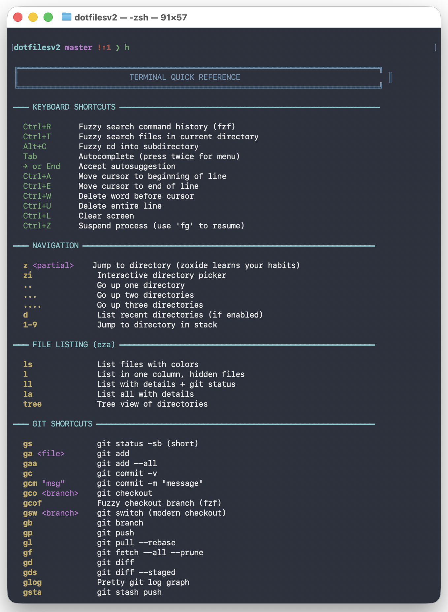

# dotfilesv2



Modern, fast Zsh configuration for macOS (Apple Silicon & Intel). Optimized for sub-100ms startup with beautiful prompt, smart navigation, and enhanced git workflow.

## Features

### Fast Shell Startup
- **Target: <100ms** initialization time
- Lazy loading for heavy tools (fnm, pyenv)
- Optimized completion caching
- No unnecessary plugins or bloat

### Beautiful Prompt (Starship)
- Git branch and status at a glance
- Language version detection (Node.js, Python, Rust)
- Command duration for slow commands
- Minimal, informative, fast

### Smart Navigation
- **zoxide** — Jump to directories by partial name (`z proj` → `~/projects/myproject`)
- **fzf** — Fuzzy search for files, history, and directories
- Auto-cd, directory stack, and path expansion

### Enhanced Git Workflow
- 40+ git aliases for common operations
- Interactive functions with safety prompts
- Fuzzy branch checkout with fzf
- Color-coded output

### Modern CLI Tools
- **eza** — Better `ls` with git status
- **bat** — Better `cat` with syntax highlighting
- **ripgrep** — Fast grep replacement
- **fd** — Fast find replacement
- **git-delta** — Beautiful git diffs

### Zsh Enhancements
- Syntax highlighting (commands turn red if invalid)
- Autosuggestions from history
- Intelligent tab completion with fuzzy matching
- Case-insensitive completions

## Requirements

- macOS (Apple Silicon or Intel)
- Zsh (default on macOS)
- [Homebrew](https://brew.sh)
- Git

## Installation

### One-Liner Install

```bash
curl -fsSL https://raw.githubusercontent.com/UD-UD/dotfilesv2/main/setup.sh | bash
```

Or with a custom install location:

```bash
DOTFILES_DIR=~/my-dotfiles curl -fsSL https://raw.githubusercontent.com/UD-UD/dotfilesv2/main/setup.sh | bash
```

### Quick Start (Manual)

```bash
# Clone the repository
git clone https://github.com/UD-UD/dotfilesv2.git ~/dotfilesv2
cd ~/dotfilesv2

# Run the bootstrap script
./bootstrap.sh
```

The bootstrap script will:
1. Check your shell (zsh required)
2. Backup existing dotfiles
3. **Prompt for your git identity** (name, email, GitHub username)
4. Initialize git submodules (zsh plugins)
5. Create symlinks
6. Optionally install packages via Homebrew

### Manual Installation

```bash
# 1. Clone the repo
git clone https://github.com/UD-UD/dotfilesv2.git ~/dotfilesv2
cd ~/dotfilesv2

# 2. Initialize git submodules (zsh plugins)
git submodule update --init --recursive

# 3. Create .gitconfig from template (fill in your info)
cp home/.gitconfig.template home/.gitconfig
# Edit home/.gitconfig with your name, email, GitHub username

# 4. Install Homebrew packages
./install/install.sh

# 5. Create symlinks
./etc/symlink_dotfiles.sh

# 6. Restart your terminal
exec zsh
```

### Backup First

Before making changes, create a backup:

```bash
./etc/backup.sh
```

To revert if something breaks:

```bash
./etc/revert.sh ~/dotfiles_backup_YYYYMMDD_HHMMSS
```

### Upgrading

Keep everything up to date with the upgrade script:

```bash
./upgrade.sh
```

This will:
- Pull latest dotfiles changes
- Update zsh plugins (git submodules)
- Upgrade Homebrew packages (starship, zoxide, fzf, etc.)

## Usage

### Quick Reference

Type `h` in your terminal to see all available shortcuts:

```bash
h          # Show full quick reference
h git      # Show all git aliases
h fzf      # Show fzf shortcuts
```

### Keyboard Shortcuts

| Shortcut | Action |
|----------|--------|
| `Ctrl+R` | Fuzzy search command history |
| `Ctrl+T` | Fuzzy search files |
| `Alt+C` | Fuzzy cd into subdirectory |
| `Tab` | Autocomplete (twice for menu) |
| `→` or `End` | Accept autosuggestion |

### Navigation

| Command | Action |
|---------|--------|
| `z <partial>` | Jump to frecent directory |
| `zi` | Interactive directory picker |
| `..` | Go up one directory |
| `...` | Go up two directories |
| `....` | Go up three directories |

### File Listing (eza)

| Command | Action |
|---------|--------|
| `ls` | List with colors |
| `l` | List in one column, hidden files |
| `ll` | List with details + git status |
| `la` | List all with details |
| `tree` | Tree view |

### Git Shortcuts

| Command | Action |
|---------|--------|
| `gs` | `git status -sb` (short) |
| `ga <file>` | `git add` |
| `gaa` | `git add --all` |
| `gc` | `git commit -v` |
| `gcm "msg"` | `git commit -m "message"` |
| `gco <branch>` | `git checkout` |
| `gcof` | Fuzzy checkout branch (fzf) |
| `gsw <branch>` | `git switch` |
| `gb` | `git branch` |
| `gp` | `git push` |
| `gl` | `git pull --rebase` |
| `gf` | `git fetch --all --prune` |
| `gd` | `git diff` |
| `gds` | `git diff --staged` |
| `glog` | Pretty git log graph |
| `gsta` | `git stash push` |
| `gstp` | `git stash pop` |

### Interactive Git Functions

```bash
gu              # Show current git user (local & global)
gundo           # Reset local branch to match remote (interactive)
gundo-remote    # Delete last commit(s) from remote (interactive)
gnew <branch>   # Create new branch from main and push
```

### Pipe Shortcuts (Global Aliases)

```bash
cmd H      # Pipe to head (first 10 lines)
cmd T      # Pipe to tail (last 10 lines)
cmd G      # Pipe to grep
cmd L      # Pipe to less
cmd CNT    # Count lines (wc -l)
```

## Directory Structure

```
dotfilesv2/
├── home/                    # Files symlinked to $HOME
│   ├── .zshrc.sh           # Main shell config (→ ~/.zshrc)
│   ├── .zshenv.sh          # Environment vars (→ ~/.zshenv)
│   ├── .zlogin.sh          # Login shell config (→ ~/.zlogin)
│   ├── .gitconfig.template # Git config template (committed)
│   ├── .gitconfig          # Your git config (gitignored, created during setup)
│   ├── .gitignore          # Global gitignore (→ ~/.gitignore)
│   ├── .hushlogin          # Suppress "Last login" message
│   └── .config/
│       └── starship.toml   # Prompt configuration
├── terminal/               # Shell modules (sourced by .zshrc)
│   ├── start.sh            # Core options, aliases, h() help
│   ├── completion.sh       # Zsh completion system
│   ├── git-alias.sh        # Git shortcuts and functions
│   ├── zsh-syntax-highlighting/   # Git submodule
│   ├── zsh-autosuggestion/        # Git submodule
│   └── zsh-completions/           # Git submodule
├── install/
│   └── install.sh          # Interactive Homebrew installer
├── etc/
│   ├── symlink_dotfiles.sh # Creates symlinks
│   ├── backup.sh           # Backup before changes
│   └── revert.sh           # Revert to backup
├── bootstrap.sh            # Full setup script
└── CLAUDE.md              # AI assistant context
```

## Customization

### Git Identity

Your git name, email, and GitHub username are collected during `bootstrap.sh` and stored in `home/.gitconfig` (which is gitignored to keep PII out of the repo).

To reconfigure:

```bash
# Re-run bootstrap
./bootstrap.sh

# Or edit directly
$EDITOR ~/dotfilesv2/home/.gitconfig
```

### Local Overrides

Create `~/.zshrc.local` for machine-specific settings:

```bash
# ~/.zshrc.local
export DOTFILES="$HOME/my-custom-path/dotfilesv2"

# Work-specific aliases
alias deploy='./scripts/deploy.sh'
```

### Change Prompt Appearance

Edit `home/.config/starship.toml`. See [Starship documentation](https://starship.rs/config/).

### Add New Aliases

Edit `terminal/start.sh` (general) or `terminal/git-alias.sh` (git-specific).

### Add Homebrew Packages

Edit `install/install.sh`:
1. Add package name to `packages` array
2. Add description to `descriptions` array (same index)

## Packages Installed

### Shell Tools
- `starship` — Cross-shell prompt
- `zoxide` — Smart directory jumper
- `fzf` — Fuzzy finder

### Modern CLI Replacements
- `eza` — Better ls
- `bat` — Better cat
- `ripgrep` — Better grep
- `fd` — Better find

### Development
- `git` — Version control
- `git-delta` — Beautiful diffs
- `gh` — GitHub CLI
- `neovim` — Modern vim
- `fnm` — Fast Node.js manager
- `python3` — Python

## Troubleshooting

### Shell won't start

```bash
# Use bash temporarily
/bin/bash

# Or start zsh without config
zsh -f

# Then revert to backup
./etc/revert.sh ~/dotfiles_backup_*
```

### Colors not showing

Make sure your terminal supports 256 colors. For iTerm2, enable "Report Terminal Type" as `xterm-256color`.

### Slow startup

Check startup time:

```bash
time zsh -i -c exit
```

If >100ms, check for slow tool initializations in `.zshrc`.

### Git submodules empty

```bash
git submodule update --init --recursive
```

## License

MIT

## Credits

- [Starship](https://starship.rs) — Prompt
- [zoxide](https://github.com/ajeetdsouza/zoxide) — Smart cd
- [fzf](https://github.com/junegunn/fzf) — Fuzzy finder
- [eza](https://github.com/eza-community/eza) — Modern ls
- [bat](https://github.com/sharkdp/bat) — Modern cat
